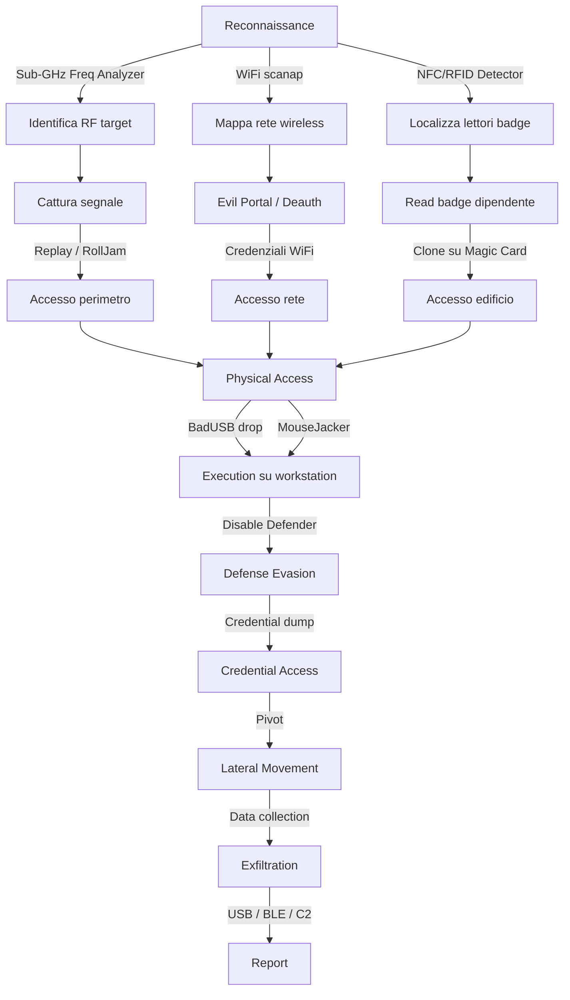

# MITRE ATT&CK Mapping - Flipper Zero

Mappatura di ogni tecnica e modulo del Flipper Zero al framework [MITRE ATT&CK](https://attack.mitre.org/). Utile per report professionali, classificazione dei finding e comunicazione con i clienti.

---

## Matrice Completa

### Reconnaissance (TA0043)

| Tecnica MITRE | ID | Modulo Flipper | Azione |
|---------------|-----|---------------|--------|
| Active Scanning | T1595 | Sub-GHz | Frequency Analyzer, Radio Scanner |
| Active Scanning | T1595 | WiFi-Marauder | `scanap`, `scansta` |
| Active Scanning | T1595 | NRF24 | Channel Scanner 2.4 GHz |
| Active Scanning | T1595 | Bluetooth | BLE Scanner |
| Active Scanning | T1595 | NFC/RFID | NFC/RFID Detector |
| Gather Victim Network Info | T1590 | WiFi-Marauder | SSID enumeration, client mapping |
| Search Open Technical Databases | T1596 | Sub-GHz | TPMS ID tracking, pager POCSAG interception |

### Resource Development (TA0042)

| Tecnica MITRE | ID | Modulo Flipper | Azione |
|---------------|-----|---------------|--------|
| Develop Capabilities | T1587 | BadUSB | Sviluppo payload DuckyScript |
| Obtain Capabilities | T1588 | Sub-GHz | Cattura segnali per replay |
| Stage Capabilities | T1608 | BadUSB | Preparazione script su SD card |

### Initial Access (TA0001)

| Tecnica MITRE | ID | Modulo Flipper | Azione |
|---------------|-----|---------------|--------|
| Hardware Additions | T1200 | BadUSB | Flipper come tastiera malevola USB |
| Hardware Additions | T1200 | NRF24 | MouseJacker keystroke injection |
| Phishing | T1566 | WiFi-Marauder | Evil Portal credential harvest |
| Supply Chain Compromise | T1195 | GPIO/Debug | Firmware manipulation via SWD |
| Valid Accounts | T1078 | NFC | Badge clonato per accesso fisico |
| Valid Accounts | T1078 | RFID | Badge RFID clonato |
| Valid Accounts | T1078 | iButton | Chiave iButton clonata |

### Execution (TA0002)

| Tecnica MITRE | ID | Modulo Flipper | Azione |
|---------------|-----|---------------|--------|
| Command and Scripting Interpreter | T1059 | BadUSB | PowerShell/CMD via keystroke injection |
| User Execution | T1204 | WiFi-Marauder | Vittima inserisce credenziali nel captive portal |
| Native API | T1106 | BadUSB | LOLBins execution (certutil, mshta, rundll32) |

### Persistence (TA0003)

| Tecnica MITRE | ID | Modulo Flipper | Azione |
|---------------|-----|---------------|--------|
| Boot or Logon Autostart | T1547 | BadUSB | Payload che aggiunge chiave di registro Run |
| Scheduled Task/Job | T1053 | BadUSB | Payload che crea scheduled task |
| Create Account | T1136 | BadUSB | Creazione utente admin nascosto |
| Modify Authentication Process | T1556 | GPIO/Debug | EEPROM modification per aggiungere badge autorizzato |

### Privilege Escalation (TA0004)

| Tecnica MITRE | ID | Modulo Flipper | Azione |
|---------------|-----|---------------|--------|
| Bypass UAC | T1548.002 | BadUSB | PowerShell UAC bypass + admin shell |
| Access Token Manipulation | T1134 | BadUSB | Token impersonation via payload |

### Defense Evasion (TA0005)

| Tecnica MITRE | ID | Modulo Flipper | Azione |
|---------------|-----|---------------|--------|
| Impair Defenses | T1562 | BadUSB | Disabilitazione Windows Defender via PowerShell |
| Obfuscated Files | T1027 | BadUSB | Payload offuscato, AMSI bypass |
| Masquerading | T1036 | NFC | Badge clonato che impersona dipendente |
| Indicator Removal | T1070 | BadUSB | Cancellazione log, history, recent files |

### Credential Access (TA0006)

| Tecnica MITRE | ID | Modulo Flipper | Azione |
|---------------|-----|---------------|--------|
| Brute Force | T1110 | Sub-GHz | Bruteforcer protocolli a codice fisso |
| Brute Force | T1110 | NFC | Dictionary attack chiavi MIFARE |
| Brute Force | T1110 | iButton | Fuzzing ID iButton |
| Credentials from Password Stores | T1555 | BadUSB | Estrazione password WiFi, browser |
| Input Capture | T1056 | NRF24 | Keystroke sniffing su tastiere wireless |
| Network Sniffing | T1040 | WiFi-Marauder | Sniff handshake WPA2, PMKID |
| Steal or Forge Authentication Certificates | T1649 | NFC | MFKey32 recupero chiavi MIFARE |
| OS Credential Dumping | T1003 | BadUSB | SAM dump, LSASS dump via payload |
| Adversary-in-the-Middle | T1557 | NFC | Relay attack NFC |

### Discovery (TA0007)

| Tecnica MITRE | ID | Modulo Flipper | Azione |
|---------------|-----|---------------|--------|
| Network Service Discovery | T1046 | WiFi-Marauder | Scan AP, client, servizi |
| System Information Discovery | T1082 | BadUSB | Script che raccoglie sysinfo |
| System Network Configuration | T1016 | BadUSB | ipconfig, arp -a, route print |
| Peripheral Device Discovery | T1120 | NRF24 | Enumerazione dispositivi wireless 2.4 GHz |
| Remote System Discovery | T1018 | WiFi-Marauder | Scan rete, ARP scan via ESP32 |

### Lateral Movement (TA0008)

| Tecnica MITRE | ID | Modulo Flipper | Azione |
|---------------|-----|---------------|--------|
| Exploitation of Remote Services | T1210 | BadUSB | Payload che stabilisce tunnel per pivot |
| Replication Through Removable Media | T1091 | USB Mass Storage | File malevolo su SD presentata come USB drive |

### Collection (TA0009)

| Tecnica MITRE | ID | Modulo Flipper | Azione |
|---------------|-----|---------------|--------|
| Data from Local System | T1005 | BadUSB | Raccolta file, credenziali, configurazioni |
| Input Capture | T1056 | NRF24 | Cattura keystroke da tastiere wireless |
| Data Staged | T1074 | BadUSB | Staging dati prima di exfiltration |
| Automated Collection | T1119 | Sub-GHz | Cattura automatica segnali RF |

### Exfiltration (TA0010)

| Tecnica MITRE | ID | Modulo Flipper | Azione |
|---------------|-----|---------------|--------|
| Exfiltration Over C2 Channel | T1041 | BadUSB | Dati inviati via reverse shell |
| Exfiltration Over Alternative Protocol | T1048 | BadUSB + BLE | Exfiltration dati via BLE al Flipper |
| Exfiltration Over Physical Medium | T1052 | USB Mass Storage | Copia dati su SD del Flipper |

### Impact (TA0040)

| Tecnica MITRE | ID | Modulo Flipper | Azione |
|---------------|-----|---------------|--------|
| Network Denial of Service | T1498 | WiFi-Marauder | Deauth flood |
| Network Denial of Service | T1498 | Sub-GHz | Jamming RF |
| Service Stop | T1489 | Infrared | Spegnimento TV/display/AC via IR |
| Endpoint Denial of Service | T1499 | Bluetooth | BLE Spam flood |
| Data Manipulation | T1565 | NFC | Modifica dati card (credito, permessi, piano) |
| Data Manipulation | T1565 | GPIO/Debug | Modifica EEPROM/firmware dispositivo |

---

## Kill Chain Tipica - Physical Pentest con Flipper Zero



---

## Uso nel Report

Quando scrivi un finding nel report di pentest, includi:

```
## Finding: Clonazione Badge NFC MIFARE Classic

**MITRE ATT&CK:**
- Tactic: Initial Access (TA0001)
- Technique: Valid Accounts (T1078)
- Sub-technique: Default Accounts (T1078.001)

**CVSS 3.1:** 8.1 (High)
**Vector:** AV:P/AC:L/PR:N/UI:N/S:U/C:H/I:H/A:N

**Descrizione:** ...
**Remediation:** Migrare a DESFire EV2/EV3 con AES...
```

Questo formato è immediatamente comprensibile per SOC, blue team e management.
