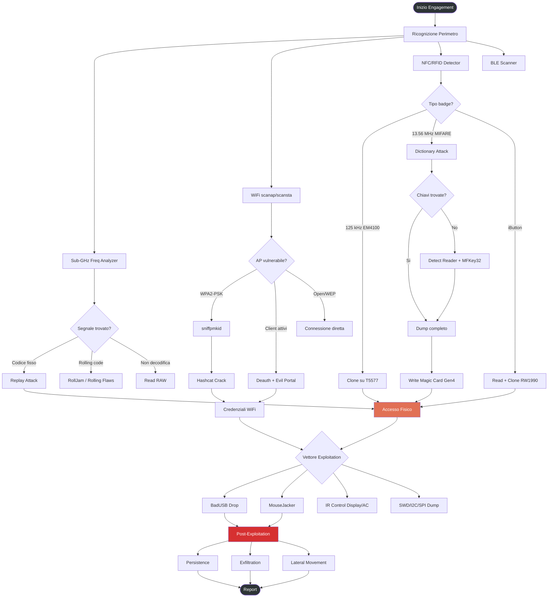
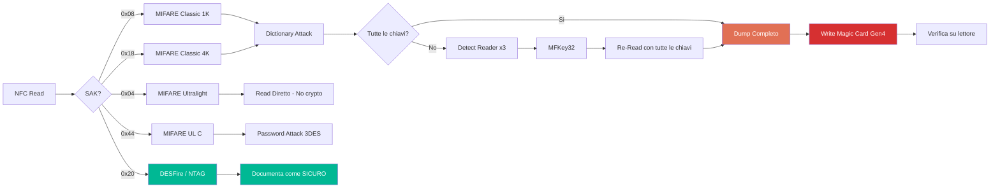
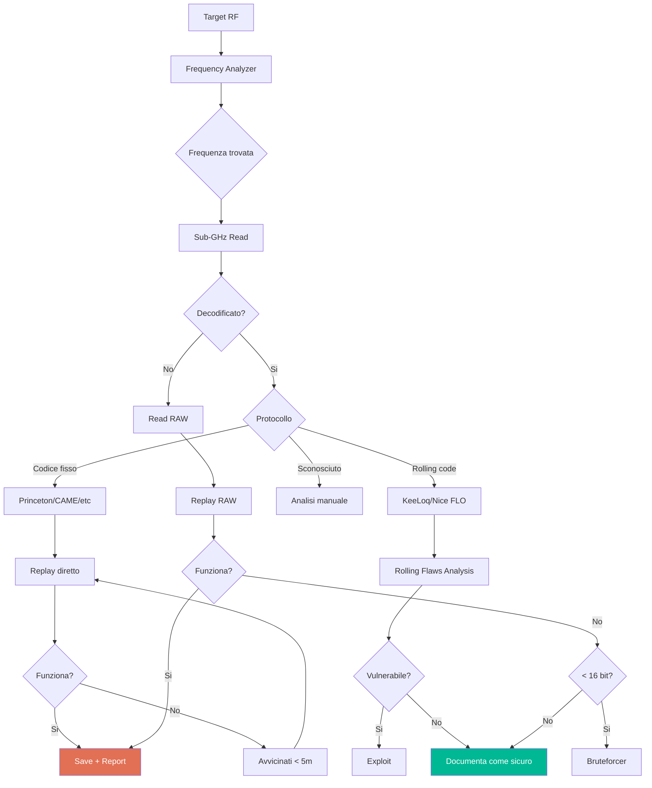
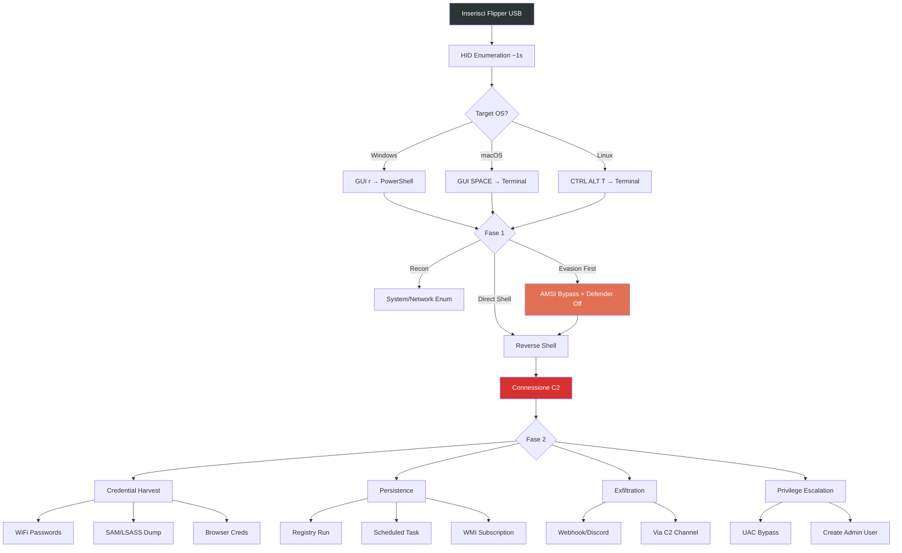
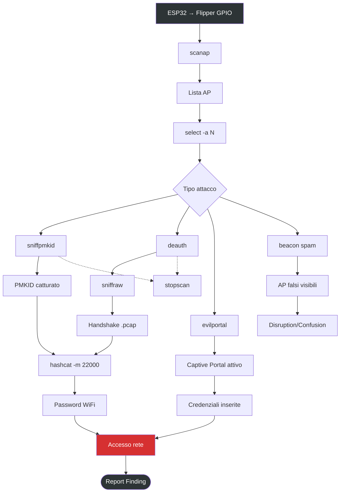
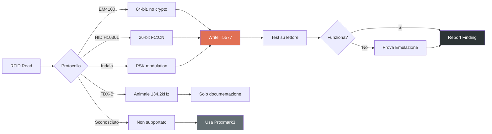

# Workflow Diagrams - Diagrammi Operativi

Diagrammi Mermaid per i workflow principali. GitHub li renderizza automaticamente.

---

## Physical Pentest Kill Chain

---

## NFC Clone Pipeline

---

## Sub-GHz Analysis Flow

---

## BadUSB Attack Chain

---

## WiFi Marauder Workflow

---

## RFID Clone Decision

