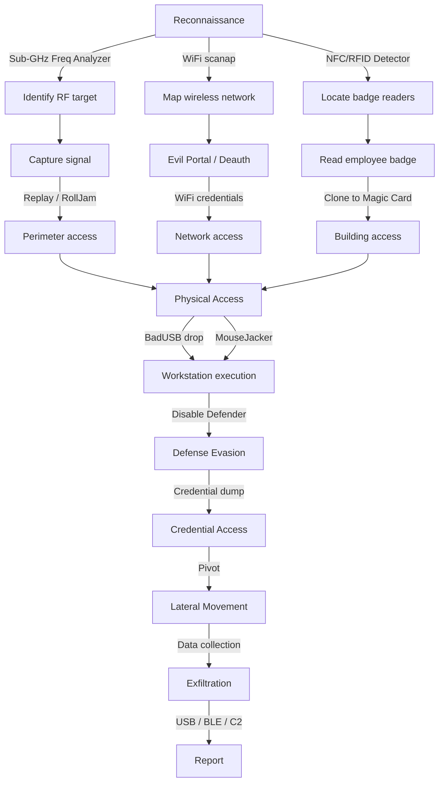

# MITRE ATT&CK Mapping - Flipper Zero

Mapping of every Flipper Zero technique and module to the [MITRE ATT&CK](https://attack.mitre.org/) framework. Useful for professional reports, finding classification, and client communication.

---

## Complete Matrix

### Reconnaissance (TA0043)

| MITRE Technique | ID | Flipper Module | Action |
|-----------------|-----|---------------|--------|
| Active Scanning | T1595 | Sub-GHz | Frequency Analyzer, Radio Scanner |
| Active Scanning | T1595 | WiFi-Marauder | `scanap`, `scansta` |
| Active Scanning | T1595 | NRF24 | Channel Scanner 2.4 GHz |
| Active Scanning | T1595 | Bluetooth | BLE Scanner |
| Active Scanning | T1595 | NFC/RFID | NFC/RFID Detector |
| Gather Victim Network Info | T1590 | WiFi-Marauder | SSID enumeration, client mapping |
| Search Open Technical Databases | T1596 | Sub-GHz | TPMS ID tracking, pager POCSAG interception |

### Resource Development (TA0042)

| MITRE Technique | ID | Flipper Module | Action |
|-----------------|-----|---------------|--------|
| Develop Capabilities | T1587 | BadUSB | DuckyScript payload development |
| Obtain Capabilities | T1588 | Sub-GHz | Signal capture for replay |
| Stage Capabilities | T1608 | BadUSB | Script preparation on SD card |

### Initial Access (TA0001)

| MITRE Technique | ID | Flipper Module | Action |
|-----------------|-----|---------------|--------|
| Hardware Additions | T1200 | BadUSB | Flipper as malicious USB keyboard |
| Hardware Additions | T1200 | NRF24 | MouseJacker keystroke injection |
| Phishing | T1566 | WiFi-Marauder | Evil Portal credential harvest |
| Supply Chain Compromise | T1195 | GPIO/Debug | Firmware manipulation via SWD |
| Valid Accounts | T1078 | NFC | Cloned badge for physical access |
| Valid Accounts | T1078 | RFID | Cloned RFID badge |
| Valid Accounts | T1078 | iButton | Cloned iButton key |

### Execution (TA0002)

| MITRE Technique | ID | Flipper Module | Action |
|-----------------|-----|---------------|--------|
| Command and Scripting Interpreter | T1059 | BadUSB | PowerShell/CMD via keystroke injection |
| User Execution | T1204 | WiFi-Marauder | Victim enters credentials in captive portal |
| Native API | T1106 | BadUSB | LOLBins execution (certutil, mshta, rundll32) |

### Persistence (TA0003)

| MITRE Technique | ID | Flipper Module | Action |
|-----------------|-----|---------------|--------|
| Boot or Logon Autostart | T1547 | BadUSB | Payload that adds registry Run key |
| Scheduled Task/Job | T1053 | BadUSB | Payload that creates scheduled task |
| Create Account | T1136 | BadUSB | Hidden admin user creation |
| Modify Authentication Process | T1556 | GPIO/Debug | EEPROM modification to add authorized badge |

### Privilege Escalation (TA0004)

| MITRE Technique | ID | Flipper Module | Action |
|-----------------|-----|---------------|--------|
| Bypass UAC | T1548.002 | BadUSB | PowerShell UAC bypass + admin shell |
| Access Token Manipulation | T1134 | BadUSB | Token impersonation via payload |

### Defense Evasion (TA0005)

| MITRE Technique | ID | Flipper Module | Action |
|-----------------|-----|---------------|--------|
| Impair Defenses | T1562 | BadUSB | Windows Defender disable via PowerShell |
| Obfuscated Files | T1027 | BadUSB | Obfuscated payload, AMSI bypass |
| Masquerading | T1036 | NFC | Cloned badge impersonating employee |
| Indicator Removal | T1070 | BadUSB | Log, history, recent files deletion |

### Credential Access (TA0006)

| MITRE Technique | ID | Flipper Module | Action |
|-----------------|-----|---------------|--------|
| Brute Force | T1110 | Sub-GHz | Bruteforcer for fixed-code protocols |
| Brute Force | T1110 | NFC | MIFARE key dictionary attack |
| Brute Force | T1110 | iButton | iButton ID fuzzing |
| Credentials from Password Stores | T1555 | BadUSB | WiFi password, browser extraction |
| Input Capture | T1056 | NRF24 | Keystroke sniffing on wireless keyboards |
| Network Sniffing | T1040 | WiFi-Marauder | WPA2 handshake sniff, PMKID |
| Steal or Forge Authentication Certificates | T1649 | NFC | MFKey32 MIFARE key recovery |
| OS Credential Dumping | T1003 | BadUSB | SAM dump, LSASS dump via payload |
| Adversary-in-the-Middle | T1557 | NFC | NFC relay attack |

### Discovery (TA0007)

| MITRE Technique | ID | Flipper Module | Action |
|-----------------|-----|---------------|--------|
| Network Service Discovery | T1046 | WiFi-Marauder | AP scan, clients, services |
| System Information Discovery | T1082 | BadUSB | Script that collects sysinfo |
| System Network Configuration | T1016 | BadUSB | ipconfig, arp -a, route print |
| Peripheral Device Discovery | T1120 | NRF24 | 2.4 GHz wireless device enumeration |
| Remote System Discovery | T1018 | WiFi-Marauder | Network scan, ARP scan via ESP32 |

### Lateral Movement (TA0008)

| MITRE Technique | ID | Flipper Module | Action |
|-----------------|-----|---------------|--------|
| Exploitation of Remote Services | T1210 | BadUSB | Payload that establishes tunnel for pivoting |
| Replication Through Removable Media | T1091 | USB Mass Storage | Malicious file on SD presented as USB drive |

### Collection (TA0009)

| MITRE Technique | ID | Flipper Module | Action |
|-----------------|-----|---------------|--------|
| Data from Local System | T1005 | BadUSB | File, credential, configuration collection |
| Input Capture | T1056 | NRF24 | Keystroke capture from wireless keyboards |
| Data Staged | T1074 | BadUSB | Data staging before exfiltration |
| Automated Collection | T1119 | Sub-GHz | Automated RF signal capture |

### Exfiltration (TA0010)

| MITRE Technique | ID | Flipper Module | Action |
|-----------------|-----|---------------|--------|
| Exfiltration Over C2 Channel | T1041 | BadUSB | Data sent via reverse shell |
| Exfiltration Over Alternative Protocol | T1048 | BadUSB + BLE | Data exfiltration via BLE to the Flipper |
| Exfiltration Over Physical Medium | T1052 | USB Mass Storage | Data copy to the Flipper's SD |

### Impact (TA0040)

| MITRE Technique | ID | Flipper Module | Action |
|-----------------|-----|---------------|--------|
| Network Denial of Service | T1498 | WiFi-Marauder | Deauth flood |
| Network Denial of Service | T1498 | Sub-GHz | RF jamming |
| Service Stop | T1489 | Infrared | TV/display/AC shutdown via IR |
| Endpoint Denial of Service | T1499 | Bluetooth | BLE Spam flood |
| Data Manipulation | T1565 | NFC | Card data modification (credit, permissions, floor) |
| Data Manipulation | T1565 | GPIO/Debug | Device EEPROM/firmware modification |

---

## Typical Kill Chain - Physical Pentest with Flipper Zero



---

## Usage in Reports

When writing a finding in the pentest report, include:

```
## Finding: NFC MIFARE Classic Badge Cloning

**MITRE ATT&CK:**
- Tactic: Initial Access (TA0001)
- Technique: Valid Accounts (T1078)
- Sub-technique: Default Accounts (T1078.001)

**CVSS 3.1:** 8.1 (High)
**Vector:** AV:P/AC:L/PR:N/UI:N/S:U/C:H/I:H/A:N

**Description:** ...
**Remediation:** Migrate to DESFire EV2/EV3 with AES...
```

This format is immediately understandable for SOC, blue team, and management.
