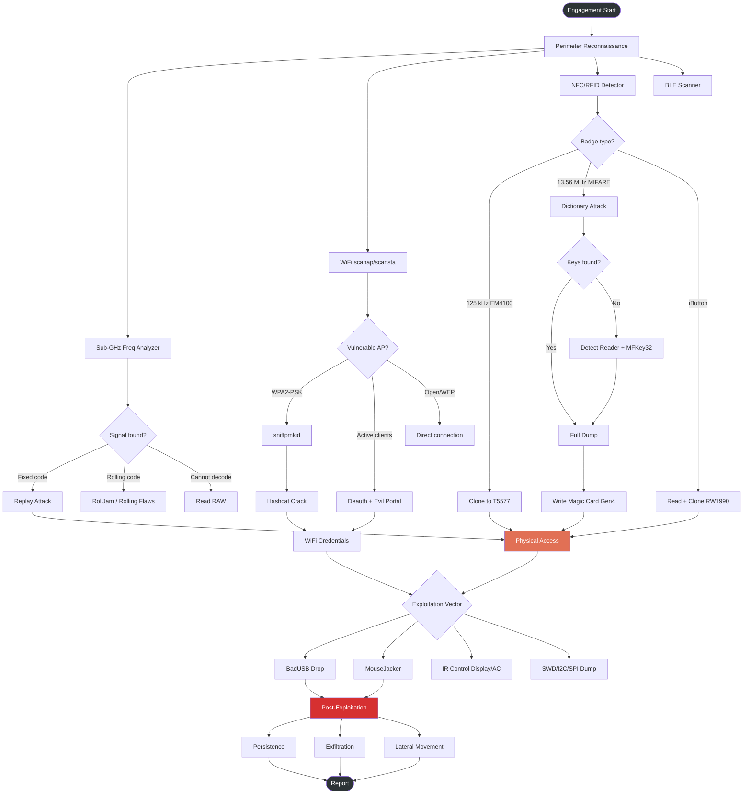
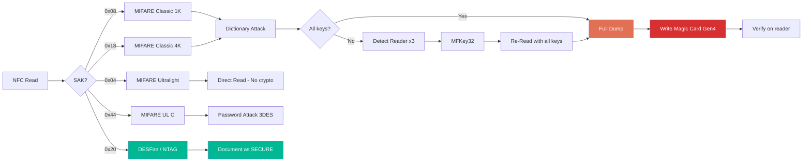
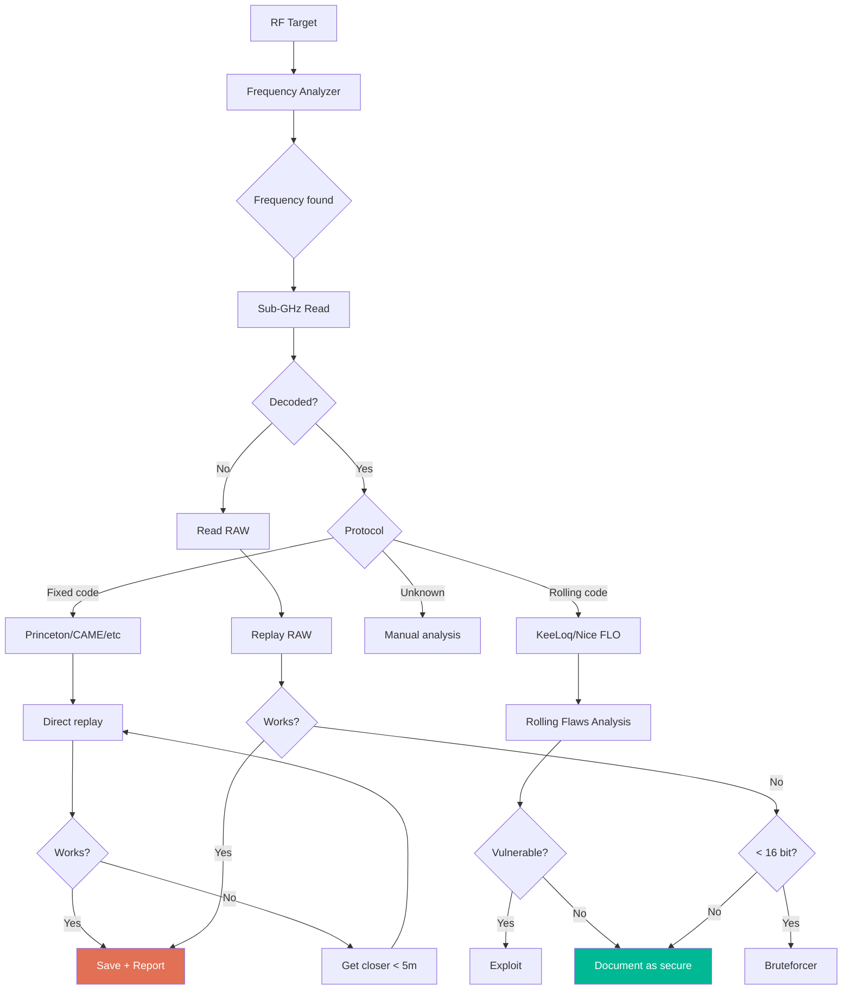
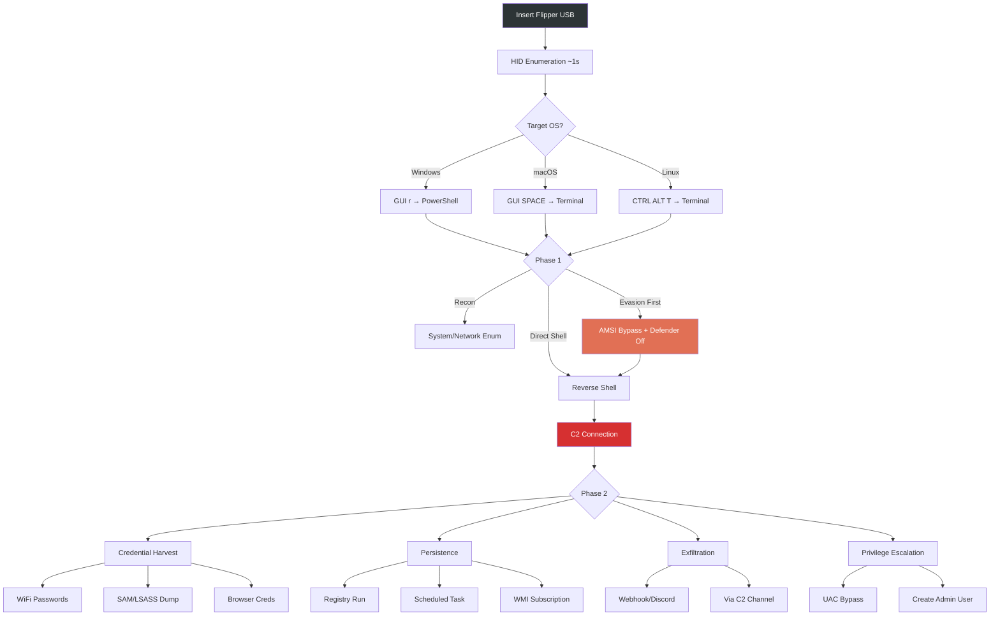
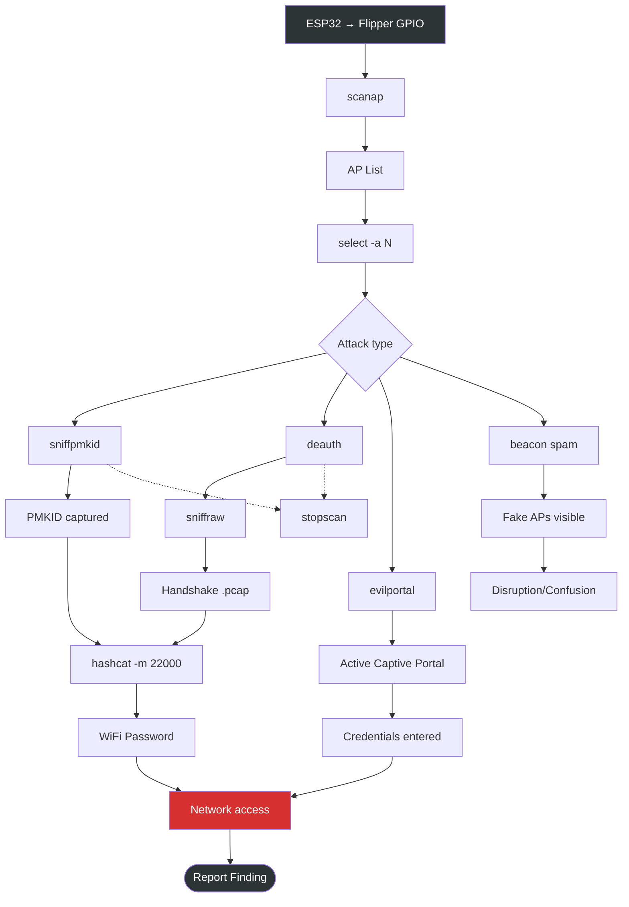
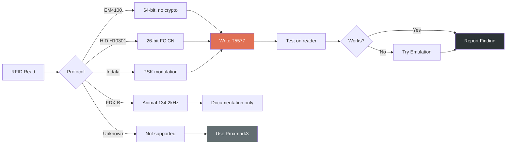

# Workflow Diagrams - Operational Diagrams

Mermaid diagrams for the main workflows. GitHub renders them automatically.

---

## Physical Pentest Kill Chain

---

## NFC Clone Pipeline

---

## Sub-GHz Analysis Flow

---

## BadUSB Attack Chain

---

## WiFi Marauder Workflow

---

## RFID Clone Decision

